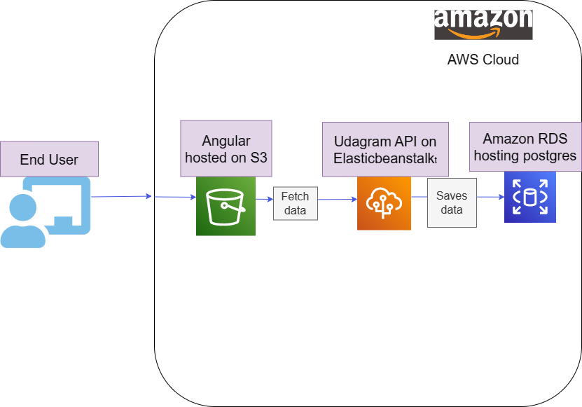

# Infrastructure Components   

- AWS S3 for storage and static web hosting   
- AWS EB or Elastic Beanstalk to deploy the backend api
- AWS RDS or relational database to host the postgresql database   

## AWS S3   

Simple storage service used in the app to store the files and host static web for front-end of the app

## AWS EB   

used to deploy the Backend api for the application to the cloud.   

## AWS RDS   

Relational database service used to store and maintain the Postgresql database.