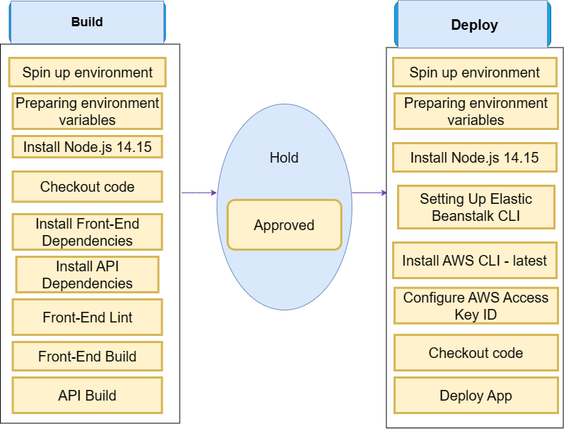

# Pipeline Cycle   

The project use CircleCI to automate the deployment process but with need to approvement as it's a continues integration.   

   

## Build   

In the build process CircleCI will preparing the environment variables, Install Node.js, Install Front-End Dependencies, Install API Dependencies, Lint Front-End Code and Build it. then build the API code.   

## Hold   

The process require approvement to start deployment as it'll reach to the End User.   

## Deploy   

When it gets to deployment the process will start by environment variables and node installition like the build step. then setting up ElasticBeanstalk CLI, Install AWS CLI - latest, then configure AWS Access Key ID, Checkout the code, and deploy both sides of front end and backend for the app.